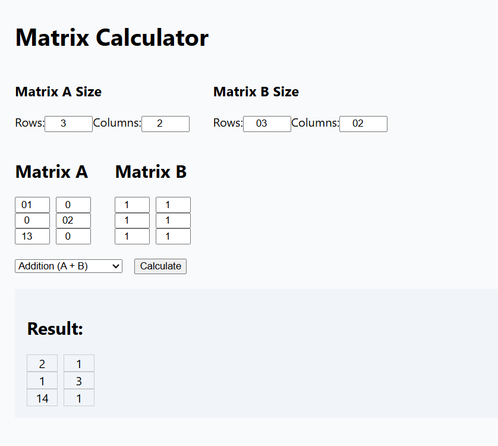
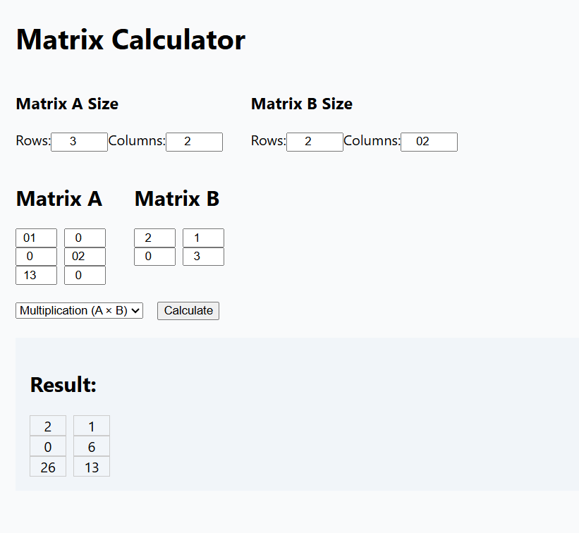

# 🧮 Matrix Calculator – Full Stack Web App

A responsive, interactive matrix calculator that performs basic matrix operations like **Addition**, **Subtraction**, **Multiplication**, and **Transpose**, built using **React (frontend)** and **Flask + NumPy (backend)**.

> ⚡ Ideal for students, developers, or anyone learning matrix operations in linear algebra. Built for educational purposes and portfolio showcasing.

---

## 🚀 Features

- 🧠 Perform matrix addition, subtraction, multiplication
- 🔁 Transpose matrices A or B
- 📏 Dynamic matrix input
- 🔌 React frontend + Flask REST API backend
- 🧼 Clean and minimal UI
- 🔒 CORS-enabled backend for API access

---

## 🛠️ Tech Stack

| Frontend (React) | Backend (Flask) | Libraries / Tools |
|------------------|------------------|-------------------|
| React, JavaScript | Flask, Python     | NumPy, Flask-CORS, Git, VS Code |

---

## 📂 Project Structure

matrix-calculator/
├── backend/
│ ├── app.py
│ └── requirements.txt
├── frontend/
│ ├── public/
│ ├── src/
│ ├── .gitignore
│ ├── package.json
│ └── ...
├── .gitignore
├── LICENSE
└── README.md


---

## 💻 Getting Started (Run Locally)

### 🧩 1. Clone the Repository

```bash
git clone https://github.com/Manya122/Matrix-Calculator.git
cd Matrix-Calculator
````

---

### 🔧 2. Set Up Backend (Python + Flask)

```bash
cd backend
pip install -r requirements.txt
python app.py
```

Runs at: `http://localhost:5000`

---

### 🎨 3. Set Up Frontend (React)

```bash
cd ../frontend
npm install
npm start
```

Runs at: `http://localhost:3000`


## 📸 Screenshots
### ➕ Matrix Addition


### ✖️ Matrix Multiplication



## 📄 License

This project is licensed under the **MIT License**.
See the [LICENSE](./LICENSE) file for details.


## 👤 Author

**Manya Sharma**
GitHub: [@Manya122](https://github.com/Manya122)


> 🌟 If you found this project useful or learned something new, don't forget to star it!


